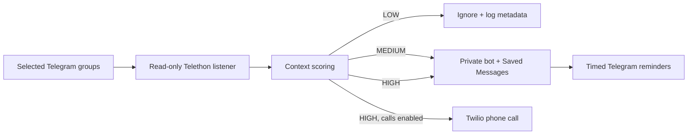

# Visa Date Alert

[](https://github.com/mayank-vekariya/visa-date-alert/actions/workflows/ci.yml)
[](https://mayank-vekariya.github.io/visa-date-alert/)
[](https://www.python.org/)
[](LICENSE)

[](https://mayank-vekariya.github.io/visa-date-alert/)

A local, read-only Telegram monitor for U.S. visa appointment reports. It watches
only the groups or channels you select, filters H1B/H4, B1/B2, Dropbox/Interview
Waiver, location, month, urgency, negative, question, and promotion context, then
sends useful leads through a private Telegram bot. HIGH-confidence reports can
optionally call your phone through Twilio.

**[View the project showcase](https://mayank-vekariya.github.io/visa-date-alert/)** ·
**[Read the complete setup guide](docs/SETUP.md)** ·
**[Understand the architecture](docs/HOW_IT_WORKS.md)**

> This project does not log in to, scrape, or automate a visa appointment site.
> It does not book appointments. Crowd-sourced alerts must always be confirmed on
> the official booking page.

## What it does

- Signs in through Telegram's client API using a separate local session.
- Watches an explicit allowlist of group/channel IDs; empty configuration stops.
- Scores new text messages with explainable, deterministic rules.
- Detects compact H1B/H4 formats such as `NA 2 All`, `OFC available`, short city
  codes, bulk appointments, and common Hinglish slot reports.
- Suppresses questions, expired/gone reports, unbookable results, duplicates,
  and agent/promotional messages.
- Delivers MEDIUM and HIGH alerts as normal notifications through a private
  BotFather bot and archives the initial alert in Saved Messages.
- Places optional Twilio calls for HIGH alerts only.
- Starts automatically at Windows sign-in and prevents duplicate monitor processes.
- Stores deduplication hashes and message IDs—not message bodies—in local SQLite.

## Signal path



| Confidence | Default score | Delivery |
| --- | ---: | --- |
| LOW | 0–4 | No notification |
| MEDIUM | 5–8 | Telegram alert, Saved Messages, reminders |
| HIGH | 9+ | Same delivery plus optional Twilio call |

## Quick start on Windows

Prerequisites: Python 3.11+ and a Telegram account.

```powershell
git clone https://github.com/mayank-vekariya/visa-date-alert.git
Set-Location .\visa-date-alert
powershell -ExecutionPolicy Bypass -File .\setup.ps1
```

The setup creates `.venv` and copies the blank `.env.example` to the ignored
local file `.env`. Fill in your own values, then run:

```powershell
.\.venv\Scripts\visa-alert.exe doctor
.\.venv\Scripts\visa-alert.exe list-chats
.\.venv\Scripts\visa-alert.exe check "H1B slots available in Hyderabad for December. Check now"
.\.venv\Scripts\visa-alert.exe run
```

The first Telegram login may ask for the code sent inside Telegram and the
account's two-step-verification password.

## Configuration

All personal values belong only in `.env`. The committed example deliberately
keeps every credential, phone number, bot chat ID, and monitored chat ID blank.

| Setting | Purpose | Secret/private |
| --- | --- | --- |
| `TELEGRAM_API_ID`, `TELEGRAM_API_HASH` | Personal Telegram client credentials | Yes |
| `TELEGRAM_PHONE` | Used for initial login | Yes |
| `TELEGRAM_ALERT_BOT_TOKEN` | Private notification bot | Yes |
| `TELEGRAM_ALERT_CHAT_ID` | Recipient for normal bot notifications | Private |
| `MONITORED_CHAT_IDS` | Explicit source allowlist | Private |
| `TARGET_VISAS`, `TARGET_LOCATIONS` | Case-insensitive detector aliases | No |
| `MEDIUM_SCORE`, `HIGH_SCORE` | Alert thresholds | No |
| `DRY_RUN` | Score and log without sending alerts | No |
| `TWILIO_*`, `ALERT_TO_NUMBER` | Optional phone-call/SMS account data | Yes |
| `ENABLE_CALLS`, `ENABLE_SMS` | Optional Twilio delivery switches | No |

For BotFather setup, Twilio trial/TwiML guidance, source selection, safe testing,
and troubleshooting, follow [the point-by-point setup guide](docs/SETUP.md).

## Safe detector testing

The `check` command is local: it does not connect to Telegram and cannot call
Twilio.

```powershell
visa-alert check "Bulk appointments Hyderabad Dec 2026"
visa-alert check "NA 2 All"
visa-alert check "Any H1B dates for Dec?"
visa-alert check "H1B slots available, low charges, ping me"
```

For a live network trial without notifications, set `DRY_RUN=true`. The monitor
will score new messages in `logs/visa-alert.log` but will not dispatch alerts.

## Private alert bot

The personal Telegram listener and the companion notification bot have separate
credentials. After creating the bot with verified [@BotFather](https://t.me/BotFather),
send it `/start` and discover the chat ID without exposing the token:

```powershell
visa-alert find-alert-chat
```

Normal Telegram bot chats support audible push notifications; Saved Messages is
kept as the personal archive.

## Optional HIGH-alert calls

Twilio is entirely optional. Calls happen only when a message scores HIGH,
`ENABLE_CALLS=true`, and the Twilio configuration is complete. Trial accounts may
require a verified destination and may play a trial announcement before the
custom alert. Phone calls and SMS can cost money.

The detector test command, configuration doctor, unit tests, and history analysis
never instantiate the Twilio dispatcher.

## Start automatically

Install the Scheduled Task for the current Windows user:

```powershell
powershell -ExecutionPolicy Bypass -File .\install-startup.ps1
Get-ScheduledTask -TaskName "Visa Date Alert Monitor"
```

The task starts at sign-in, retries transient failures, and uses the application's
singleton lock. Remove only the task—without deleting configuration or data—with
`uninstall-startup.ps1`.

## Verification

```powershell
.\.venv\Scripts\python.exe -m pip install -e ".[dev]"
.\.venv\Scripts\ruff.exe check .
.\.venv\Scripts\python.exe -m unittest discover -s tests -v
```

The suite currently contains **23 passing tests** for detection, false-positive
suppression, deduplication, and single-instance behavior. GitHub Actions runs lint
and tests on Python 3.11, 3.12, and 3.13 without credentials.

## Repository map

```text
visa_alert_bot/       Python monitor, detector, alerts, state, and CLI
tests/                Offline unit tests—no live accounts
docs/                 GitHub Pages showcase and detailed guides
.github/workflows/    Public credential-free CI
setup.ps1             Local environment bootstrap
install-startup.ps1   Windows sign-in task installer
.env.example          Blank secrets plus safe detector defaults
```

## Privacy and scope

- `.env`, `data/`, `*.session`, `logs/`, databases, and build artifacts are ignored.
- The public repository contains no personal phone number, Telegram/Twilio token,
  API hash, private chat ID, source chat ID, session file, or copied private message.
- Alerts are leads, never guarantees.
- Source groups are unofficial and may contain scams; see the
  [source-selection checklist](docs/SOURCE_SELECTION.md).
- The project is not affiliated with Telegram, Twilio, any embassy, or the U.S.
  Department of State.

See [SECURITY.md](SECURITY.md) before deployment and [CONTRIBUTING.md](CONTRIBUTING.md)
before proposing changes. Released under the [MIT License](LICENSE).
