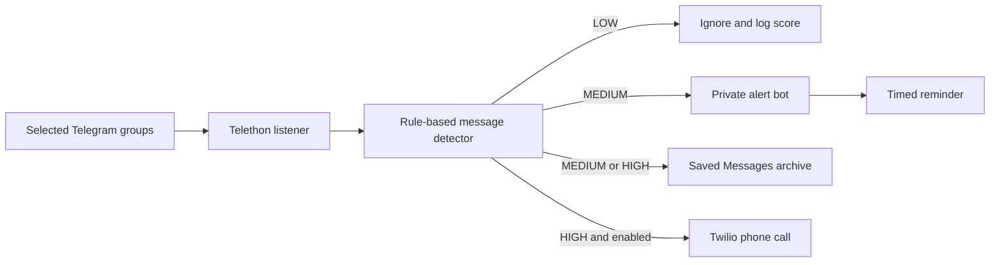

# How Visa Date Alert works

Visa Date Alert is a local, read-only listener. It signs in through Telegram's
client API as the user, watches only explicitly configured chats, scores each new
text message, and sends a separate private notification when the evidence is
strong enough.

## 1. Source boundary

`MONITORED_CHAT_IDS` is required and explicit. An empty value stops startup, so
the application cannot accidentally listen to every Telegram conversation. The
listener does not post, react, mark messages as read, scrape an entire account,
or automate the visa-booking website.

## 2. Detection

Message text is Unicode-normalized and compared with configurable B-2 tourist-visa
aliases and Indian consulate locations. The detector combines evidence instead of
alerting on one broad word:

- slot/open/available and bulk-appointment phrases;
- a target visa such as B2, B-2, B1/B2, tourist visa, or visitor visa;
- a target city or short code such as Hyderabad or HYD;
- urgency and appointment-month context.

Hard negatives stop common false alarms first: `NA`, no slots, already gone,
closed, past availability, questions, no submit button, and agent/promotional
messages. Explicit B-1-only, H, F, L, O, and J category posts are rejected unless
the same message also names the accepted combined B-1/B-2 tourist category.
Configured aliases are matched as whole terms, so `B2` does not match `B20`.

The score maps to three levels:

| Level | Default score | Result |
| --- | ---: | --- |
| LOW | 0–4 | Logged only |
| MEDIUM | 5–8 | Telegram bot + Saved Messages + reminders |
| HIGH | 9+ | Same alerts, plus a Twilio call when enabled |

The thresholds are configurable in `.env`.

## 3. Deduplication and privacy

SQLite stores the source chat ID, source message ID, timestamps, and SHA-256
fingerprints used to prevent repeats. Message bodies are not stored in the
database. Logs contain scoring metadata, not configured credentials.

The local Telegram `.session` file is sensitive because it represents an active
account login. It and `.env` are ignored by Git and must never be uploaded.

## 4. Alert delivery

The private companion bot produces normal Telegram notifications, including the
source title, original message, timestamp, confidence score, and original-message
link when Telegram exposes one. Saved Messages provides a personal archive.

Twilio is optional. Calls are created only for HIGH alerts and only when both
`ENABLE_CALLS=true` and all required Twilio settings are present. A public HTTPS
TwiML URL can be used when a trial account cannot retrieve inline TwiML.

## 5. Runtime

On Windows, `install-startup.ps1` creates one Scheduled Task that starts the monitor
at sign-in and another that checks a once-per-minute heartbeat every hour. A stale
or missing heartbeat causes a clean monitor restart. A file lock prevents multiple
instances. `status.ps1` reports the current task and heartbeat state. The computer
must be on and online to listen; missed checks resume when Windows is available.

## Limitations

- Telegram reports are crowd-sourced and can be wrong or late.
- Groups can change names, access rules, and message conventions.
- The monitor cannot reserve a slot and should never be given visa-site passwords.
- Phone calls and SMS may incur Twilio charges.
- This project is not affiliated with Telegram, Twilio, any embassy, or the U.S.
  Department of State.
